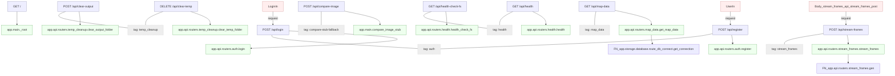

```mermaid
graph TD
classDef endpoint fill:#eef,stroke:#88a,stroke-width:1px;
classDef handler  fill:#efe,stroke:#6a6,stroke-width:1px;
classDef data     fill:#fee,stroke:#c88,stroke-width:1px;
classDef tag      fill:#eee,stroke:#bbb,stroke-dasharray: 3 3;
classDef dep      fill:#fff4cc,stroke:#c7a84f,stroke-width:1px;

%% Tag nodes (one per tag)
TAG_auth["tag: auth"]:::tag
TAG_compare-stub-fallback["tag: compare-stub-fallback"]:::tag
TAG_health["tag: health"]:::tag
TAG_map_data["tag: map_data"]:::tag
TAG_stream_frames["tag: stream_frames"]:::tag
TAG_temp_cleanup["tag: temp_cleanup"]:::tag
EP___GET["GET /"]:::endpoint
FN_app.main._root["app.main._root"]:::handler
EP___GET --> FN_app.main._root
click FN_app.main._root "file:///C:/Projects/RouteMap/backend_match/app/main.py#L56" "Open source"
EP_api_register_POST["POST /api/register"]:::endpoint
FN_app.api.routers.auth.register["app.api.routers.auth.register"]:::handler
EP_api_register_POST --> FN_app.api.routers.auth.register
click FN_app.api.routers.auth.register "file:///C:/Projects/RouteMap/backend_match/app/api/routers/auth.py#L43" "Open source"
DT_UserIn["UserIn"]:::data
DT_UserIn -->|request| EP_api_register_POST
EP_api_register_POST --- TAG_auth
EP_api_login_POST["POST /api/login"]:::endpoint
FN_app.api.routers.auth.login["app.api.routers.auth.login"]:::handler
EP_api_login_POST --> FN_app.api.routers.auth.login
click FN_app.api.routers.auth.login "file:///C:/Projects/RouteMap/backend_match/app/api/routers/auth.py#L63" "Open source"
DT_LoginIn["LoginIn"]:::data
DT_LoginIn -->|request| EP_api_login_POST
EP_api_login_POST --- TAG_auth
EP_api_clear-temp_DELETE["DELETE /api/clear-temp"]:::endpoint
FN_app.api.routers.temp_cleanup.clear_temp_folder["app.api.routers.temp_cleanup.clear_temp_folder"]:::handler
EP_api_clear-temp_DELETE --> FN_app.api.routers.temp_cleanup.clear_temp_folder
click FN_app.api.routers.temp_cleanup.clear_temp_folder "file:///C:/Projects/RouteMap/backend_match/app/api/routers/temp_cleanup.py#L18" "Open source"
EP_api_clear-temp_DELETE --- TAG_temp_cleanup
EP_api_clear-output_POST["POST /api/clear-output"]:::endpoint
FN_app.api.routers.temp_cleanup.clear_output_folder["app.api.routers.temp_cleanup.clear_output_folder"]:::handler
EP_api_clear-output_POST --> FN_app.api.routers.temp_cleanup.clear_output_folder
click FN_app.api.routers.temp_cleanup.clear_output_folder "file:///C:/Projects/RouteMap/backend_match/app/api/routers/temp_cleanup.py#L34" "Open source"
EP_api_clear-output_POST --- TAG_temp_cleanup
EP_api_stream-frames_POST["POST /api/stream-frames"]:::endpoint
FN_app.api.routers.stream_frames.stream_frames["app.api.routers.stream_frames.stream_frames"]:::handler
EP_api_stream-frames_POST --> FN_app.api.routers.stream_frames.stream_frames
click FN_app.api.routers.stream_frames.stream_frames "file:///C:/Projects/RouteMap/backend_match/app/api/routers/stream_frames.py#L41" "Open source"
DT_Body_stream_frames_api_stream_frames_post["Body_stream_frames_api_stream_frames_post"]:::data
DT_Body_stream_frames_api_stream_frames_post -->|request| EP_api_stream-frames_POST
EP_api_stream-frames_POST --- TAG_stream_frames
EP_api_map-data_GET["GET /api/map-data"]:::endpoint
FN_app.api.routers.map_data.get_map_data["app.api.routers.map_data.get_map_data"]:::handler
EP_api_map-data_GET --> FN_app.api.routers.map_data.get_map_data
click FN_app.api.routers.map_data.get_map_data "file:///C:/Projects/RouteMap/backend_match/app/api/routers/map_data.py#L16" "Open source"
EP_api_map-data_GET --- TAG_map_data
EP_api_health_GET["GET /api/health"]:::endpoint
FN_app.api.routers.health.health["app.api.routers.health.health"]:::handler
EP_api_health_GET --> FN_app.api.routers.health.health
click FN_app.api.routers.health.health "file:///C:/Projects/RouteMap/backend_match/app/api/routers/health.py#L18" "Open source"
EP_api_health_GET --- TAG_health
EP_api_health-check-fs_GET["GET /api/health-check-fs"]:::endpoint
FN_app.api.routers.health.health_check_fs["app.api.routers.health.health_check_fs"]:::handler
EP_api_health-check-fs_GET --> FN_app.api.routers.health.health_check_fs
click FN_app.api.routers.health.health_check_fs "file:///C:/Projects/RouteMap/backend_match/app/api/routers/health.py#L23" "Open source"
EP_api_health-check-fs_GET --- TAG_health
EP_api_compare-image_POST["POST /api/compare-image"]:::endpoint
FN_app.main.compare_image_stub["app.main.compare_image_stub"]:::handler
EP_api_compare-image_POST --> FN_app.main.compare_image_stub
click FN_app.main.compare_image_stub "file:///C:/Projects/RouteMap/backend_match/app/main.py#L143" "Open source"
EP_api_compare-image_POST --- TAG_compare-stub-fallback

%% Call graph from handlers (1 hop)
FN_app.api.routers.map_data.get_map_data --> FN_app.storage.database.route_db_connect.get_connection
FN_app.api.routers.stream_frames.stream_frames --> FN_app.api.routers.stream_frames.gen


```
